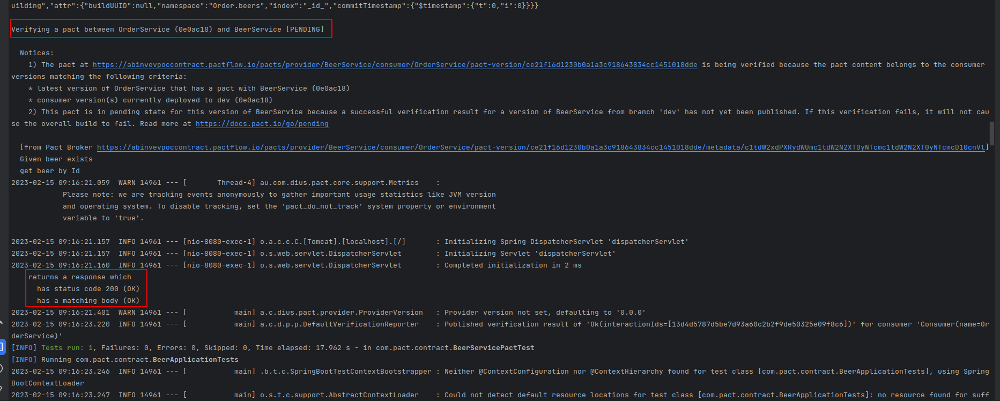
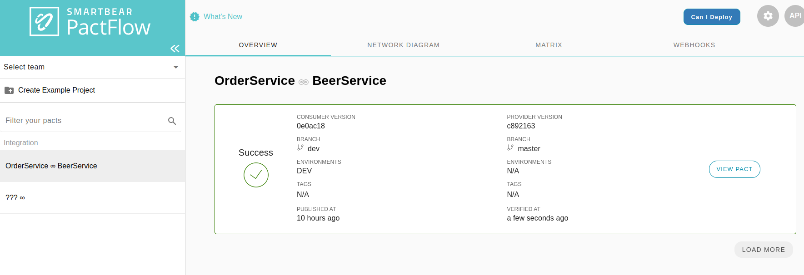
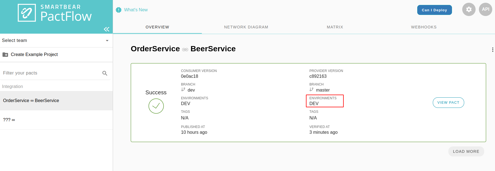
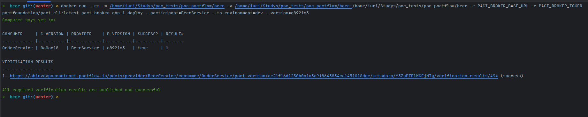

## Contract Test - Provider

---

### **Configuration**

*   Spring

```xml
<!-- exclude junit 4 -->
<dependency>
    <groupId>org.springframework.boot</groupId>
    <artifactId>spring-boot-starter-test</artifactId>
    <scope>test</scope>
    <exclusions>
        <exclusion>
            <groupId>junit</groupId>
            <artifactId>junit</artifactId>
        </exclusion>
    </exclusions>
</dependency>
```

*   Pact

```xml
<!-- https://mvnrepository.com/artifact/au.com.dius.pact.provider/junit5spring -->
<dependency>
    <groupId>au.com.dius.pact.provider</groupId>
    <artifactId>junit5spring</artifactId>
    <version>4.4.3</version>
</dependency>
```

*   **mongo**

```xml
<dependency>
    <groupId>de.flapdoodle.embed</groupId>
    <artifactId>de.flapdoodle.embed.mongo.spring30x</artifactId>
    <version>4.3.2</version>
    <scope>test</scope>
</dependency>
```

> It is possible to use testcontainer to mock the resources during the tests, too.

*   **Junit**

```xml
<dependency>
    <groupId>org.junit.jupiter</groupId>
    <artifactId>junit-jupiter-api</artifactId>
    <version>5.7.2</version>
    <scope>test</scope>
</dependency>
<dependency>
    <groupId>org.junit.jupiter</groupId>
    <artifactId>junit-jupiter-engine</artifactId>
    <version>5.7.2</version>
    <scope>test</scope>
</dependency>
```

For different consumer projects from the provider side, we can configure some configurations in the application.yml inside the resources test folder. We can add the following configurations:

```xml
pactbroker:
  host: ${HOST_ENVIRONMENT:pact.pactflow.io}
  scheme: ${SCHEMA_ENVIRONMENT:https}
  port: ${PORT_ENVIRONMENT:443}
  auth:
    token: ${ACCESS_TOKEN_READ_AND_WRITE:jajdd3sj24R9WsW}
```

---

### **Test Class**

> This is an example of an integration test where the microservice starts and the pact broker simulates being the consumer and makes the request for the microservice with the environment with all the resources .

```java
@SpringBootTest(classes = BeerApplication.class, webEnvironment = SpringBootTest.WebEnvironment.DEFINED_PORT)
@Provider("BeerService")
@PactBroker
public class BeerServicePactTest {

    @LocalServerPort
    private int port;

    @Autowired
    private BeerRepository beerRepository;

    @BeforeEach
    void setup(PactVerificationContext context) {
        context.setTarget(new HttpTestTarget("localhost", port));
    }

    @TestTemplate
    @ExtendWith(PactVerificationSpringProvider.class)
    void pactVerificationTestTemplate(PactVerificationContext context) {
        context.verifyInteraction();
    }
    @State(value = "beer exists", action = StateChangeAction.SETUP)
    void productsExists() {
        beerRepository.deleteAll();
        beerRepository.saveAll(Arrays.asList(
                        new Beer("63c18997cf5ec173590cc15a", "BHRAMA", "AMBEV", new BigDecimal(2.52).setScale(2, BigDecimal.ROUND_UP), "TEst"),
                        new Beer("e00111fc959f11eda1eb0242", "SKOL", "AMBEV", new BigDecimal(3.22).setScale(2, BigDecimal.ROUND_UP), "Test")
        ));
    }
}
```

*   **Class annotations**
    *   `@SpringBootTest` starts the spring boot to make integration tests called the API.
    *   `@Provider("BeerService")` is the annotation that informs which provider .
    *   `@PactBroker` annotation to configure the provider with the configurations to connect with the pact broker inside the application.yml
*   **Interceptor**
    *   `@BeforeEach void setup(PactVerificationContext context)` is a method to configure the pact broker with the service provider started during the tests.
*   **Verifier**
```java
@TestTemplate
    @ExtendWith(PactVerificationSpringProvider.class)
    void pactVerificationTestTemplate(PactVerificationContext context) {
        context.verifyInteraction();
    }
```
*   * For writing Pact verification tests with JUnit 5, there is an JUnit 5 Invocation Context Provider that you can use with the @TestTemplate annotation. This will generate a test for each interaction found for the pact files for the provider.

*   **Unit Test**
    
    * To test the provider there is no @Test to map, the pact from the provider service side generates states and when the service is up, the pact broker will get the lists of scenarios from the consumer side and use the requests as examples to call provider service by the state set on the given method that consumer service set.

    * `@State` is the annotation that specify the which state the pact broker should mount to execute the request for that scenarios in all scenarios.
        * `value` this parameter works specifying the state set on the given method from consumer service side.
        * `action` this parameter works to specify when the state should execute (setup or teardown).

---

### **Execution**

After mapping all states for the scenarios, we need to validate all the scenarios.

Execute `mvn clean verify` and wait for the build communicate with the pact broker and execute all scenarios  with the states mapped.

> The method above validate the scenarios but not publish the result to validate,if you want to publish the result of the tests, you need to set the java system enviroment during the maven command: -Dpact.verifier.publishResults=true



---

### **Pact Broker Operations**

The pact provides the user with a tool called Pact CLI, which integrates with the pact broker and do all the operations available there.

[Documentation](https://docs.pact.io/implementation_guides/cli)

Also, you can use the docker image that the tool offers.

[Docker Pact CLI](https://hub.docker.com/r/pactfoundation/pact-cli)

---

### **Publication**

To publish the results it is possible during the build setting the java environment variable:

```xml
-Dpact.verifier.publishResults=true
```

And the full command should be: 

```xml
mvn clean verify -Dpact.verifier.publishResults=true \
                 -Dpact.provider.branch=${ENV} \
                 -Dpact.provider.version=${GIT_COMMIT}
```

- `-Dpact.verifier.publishResults` configuration that informs to publish the result of the tests on the pact broker.
- `-Dpact.provider.branch` the branch specifying where the contract was created.
- `-Dpact.provider.version` the version of that contract.



---

### **Environment**

Looking at the image above we can see that the environment was not already there, after publishing a contract, it is important that we set the environment in the new contract that was published. To do this operation, the pact CLI has a command to do it.

```plaintext
docker run --rm -w ${PWD} -v ${PWD}:${PWD} -e PACT_BROKER_BASE_URL -e PACT_BROKER_TOKEN pactfoundation/pact-cli:latest pact-broker record-deployment --pacticipant=OrderService --version=${GIT_COMMIT} --environment=${ENV}
```

Definitions:

*   `${PWD}` the current path that the command will run
*   `PACT_BROKER_BASE_URL` Url of the pact broker
*   `PACT_BROKER_TOKEN` Token to access the pact broker
*   `--pacticipant` property to inform the provider name of the contract published
*   `--version` is the version of the contract published.
*   `--environment` references the environment in which the contract was published and used to validate the consumer service.



---

### **Deploy**

To validate if it is possible to deploy a version of the provider safely, we can run a feature from a pact called "Can I Deploy". It is a feature that validates the latest version of a contract between a consumer and a provider.

To check if it is possible to deploy the code, we can run this command:

```plaintext
docker run --rm -w ${PWD} -v ${PWD}:${PWD} -e PACT_BROKER_BASE_URL -e PACT_BROKER_TOKEN pactfoundation/pact-cli:latest pact-broker can-i-deploy --pacticipant=OrderService --to-environment=${ENV} --version=${GIT_COMMIT}
```

Definitions:

*   `${PWD}` the current path that the command will run
*   `PACT_BROKER_BASE_URL` Url of the pact broker
*   `PACT_BROKER_TOKEN` Token to access the pact broker
*   `--pacticipant` property to inform the provider name of the contract published
*   `--to-environment` references the environment in which the contract was published and used to validate the consumer service.
*   `--version` is the version of the contract published.

